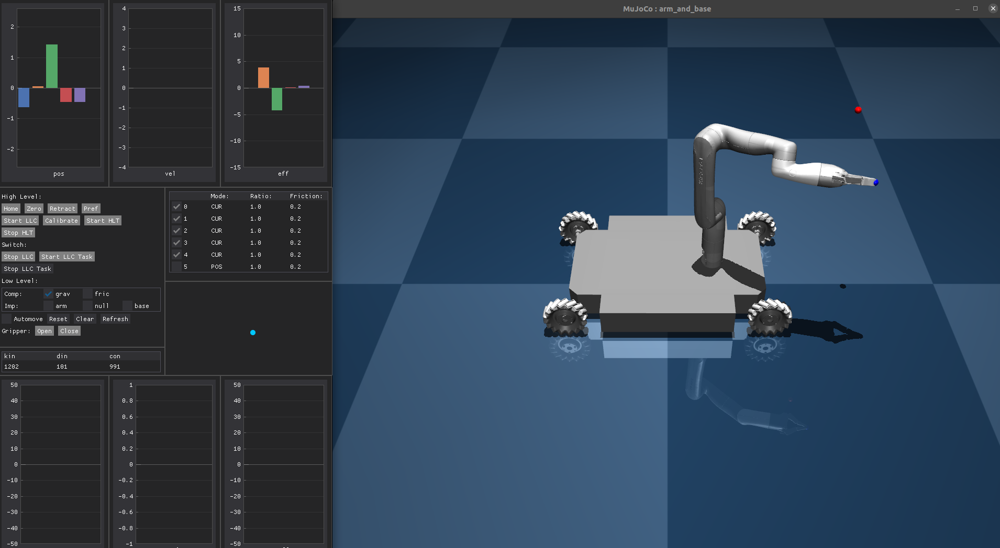

# Mobile Manipulator Compliance

This repo contains the code accompanying the paper "Current-Based Impedance Control for Interacting with Mobile Manipulators" to control a mobile manipulator. We implement a current-based impedance controller on the arm and present two operational modes for interacting with the whole mobile manipulator.

## Summary

Guidance Mode        |  Tracking Mode
:-------------------------:|:-------------------------:
  |  

As robots transition from industrial settings to human-centered spaces, integrating mobile manipulation and compliant control becomes vital for efficient and safe task execution. Compliance is commonly achieved through indirect force control methods such as admittance and impedance control. However, these methods require contact information that are typically derived from measurements of the joint torques or from a force/torque sensor mounted at the end-effector. Such equipment can be expensive, and off-the-shelf robots might not come equipped with them. Further challenges arise based on the control mode supported by the robot. For instance, while admittance control can be applied to position/velocity-controlled robots, compliance is only achieved concerning the measured forces. On the other hand, impedance control is exclusive to torque-controlled robots, yet it effectively achieves compliance to all forces interacting with the robot. Therefore, implementing compliant control on a mobile manipulator poses significant challenges. 

We leverage the direct correlation between the actuator current and the resulting joint torque, overcoming the typical reliance of impedance control on torque sensors. Additionally, this paper presents two operational modes for interacting with the mobile manipulator: one for guiding the robot around the workspace through interacting with the arm and another for executing a tracking task, both maintaining compliance to external forces.

## Installation
We use a docker container to allow to quickly and reliably run the code. Detailed installation instructions can be found [here](/docs/installation.md).

## Simulation


We use Mujoco to simulate the mobile manipulator. To start the simulation run (for ROS1):
```bash
roslaunch launcher simulation.launch
```

1. Click `<Refresh>` to get the robot's state. 
2. Press `<Start-LLC>`, press `<Start-LLC-Task>` to switch to lower level control. Note, that the mode changed from POS to CUR. The robot is now in current mode, and gravity compensation is turned on. It is possible to also turn on friction compansation but note that the used parameters were identified for the real platform and might not reperesent the simulated environment.
3. In Mujoco it is possible to interact with the robot by e.g. applying a force. To do so, double click on the desired robot link, then press `<ctr, right-click mouse>` and drag the robot to a desired pose.
Additional keys for Mujoco, can be found online. If you do <tab> you get all the infopannels, or <f1> to get an overview of some commands that you can do. 
4. To stop low level control press `<Stop LLC-Task>`, `<Stop LLC>`
5. High level control can be used to go to the zero possition, `<Zero>`, preferred position `<Pref>`, retracted position `<Retract>`.
6. The blue dot can be used to control the base, cllick and drag the point to do so.

To close the simulation window, press esc when the window is selected.

## Application on the Robot
Instructions are provided [here](/docs/application_on_robot.md).

## Kinova's estimated current/torque ratios.

Kinova provides current feedback and an estimated torque feedback. Measurements show they used these current/torque ratios:


Joint: | Size: | Ratio:
-------|-------|-------
| 0 | M | 0.85
| 1 | L | 0.25
| 2 | M | 0.85
| 3 | S | 1.75
| 4 | S | 1.75
| 5 | S | 1.75


## INTERACTING WITH THE SIMULATION
To start the simulation (if not done already)
```bash
roslaunch launcher simulation.launch
```
To escale simulation, <esc>.

1. Click refresh at first, to send message to the robot to get the state. 
2. Press <Start-llc>, press <Start-llc-task>, now it is in current mode, and it is only compensating gravity. To stop <stop llc>
3. To interact with the robot, <ctr, right-click mouse> and drag the robot to a desired pose.  
4. To stop <stop llc-task>, <stop llc>
5. To go to a desired position again: press <pref> and select a position that you would like.


Other comments:

- If you would like to remove the toolbox automatically from your screen: settings, appearance, auto-hide the dock.
- If you would like to calibrate, press <calibrate>, but it will take some time. 


## Troubleshooting

If you run into problems of any kind, do not hesitate to open an issue on this repository.

Solutions to common issues are presented [here](docs/troubleshooting.md)


